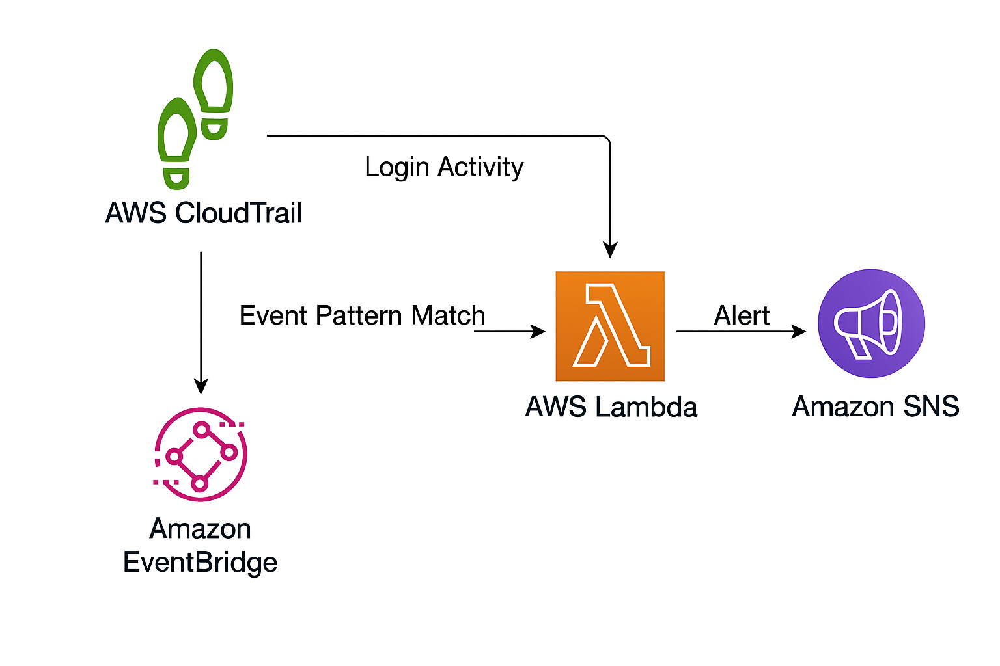

# 🛡️ AWS Security Incident Response – Failed Console Login Detection

A serverless security monitoring solution that detects failed AWS Console login attempts (without MFA) in real time using **CloudTrail**, **EventBridge**, **Lambda**, and **SNS** — all deployed as **Infrastructure as Code (IaC)** via **AWS CloudFormation**.



---

## 🚀 Features

- 🔐 Monitors failed AWS Console login attempts without MFA
- 📩 Sends immediate alerts via Amazon SNS
- ⚙️ Fully automated with CloudFormation
- 🧾 Uses CloudTrail logs as event source
- 🔄 EventBridge rule triggers Lambda in real-time
- 💡 Easily extendable for auto-remediation

---

## 🧱 Architecture Overview

1. **AWS CloudTrail** logs sign-in events across the account
2. **Amazon EventBridge** filters for `ConsoleLogin` failures without MFA
3. **AWS Lambda** function is triggered when a suspicious login is detected
4. **Amazon SNS** sends an email or SMS alert to security personnel

---

## 🛠️ Services Used

- [x] AWS CloudTrail
- [x] Amazon EventBridge
- [x] AWS Lambda (Python)
- [x] Amazon SNS
- [x] IAM Roles & Policies
- [x] AWS CloudFormation

---

## 📦 Project Structure
aws-security-incident-response/
├── README.md
|── security-monitor.yaml
├── lambda/
│   └── index.py         # Python script for the Lambda function
└── aws-incident-response.png

## 🔬 Testing

You can test the setup in two ways:

### ✅ 1. Simulate a Failed Console Login

* Create an IAM user with no MFA
* Attempt a login via AWS Console in Incognito mode
* Trigger the `ConsoleLogin` failure

### 🧪 2. Manually Invoke Lambda (for testing)

Use the AWS Lambda Console → "Test" tab and input this event:

```json
{
  "detail": {
    "eventName": "ConsoleLogin",
    "userIdentity": {
      "type": "IAMUser",
      "userName": "test-user"
    },
    "additionalEventData": {
      "MFAUsed": "No"
    },
    "responseElements": {
      "ConsoleLogin": "Failure"
    }
  }
}
```

---

## 🧠 Possible Enhancements

* 🚫 Automatically disable suspicious IAM users
* 📊 Integrate with AWS Security Hub or AWS Config
* 🧩 Convert to Terraform or CDK for cross-tool experience
* 📮 Send alerts to Slack using Lambda

---
